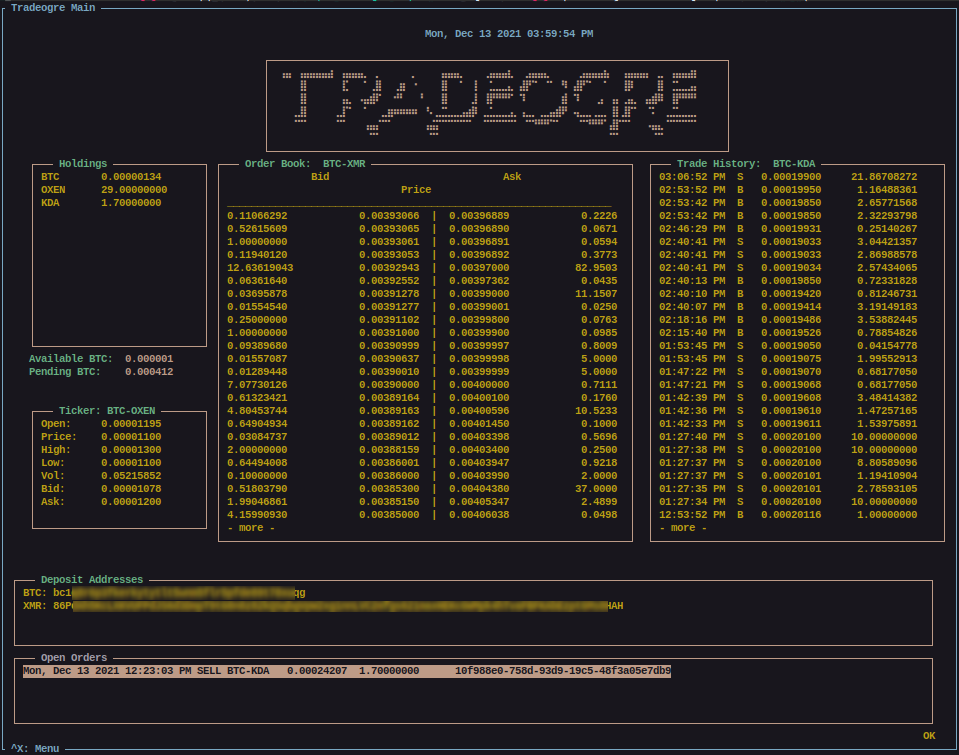
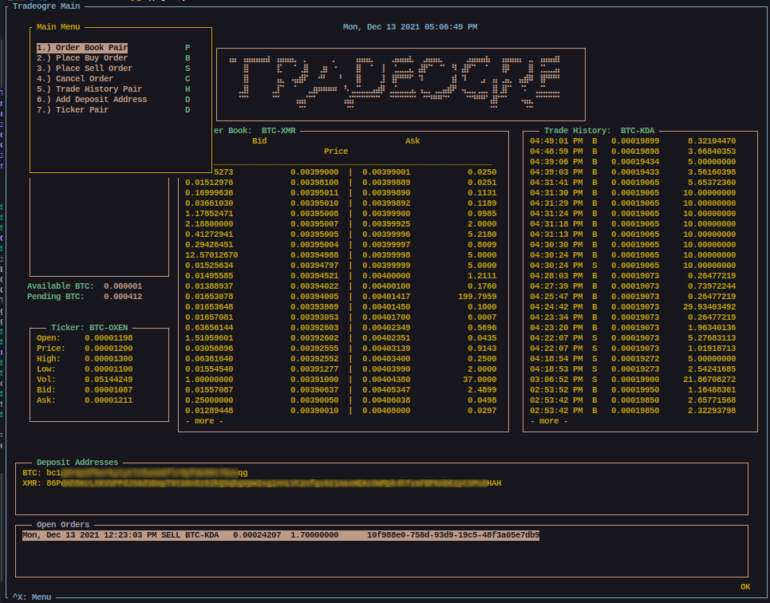
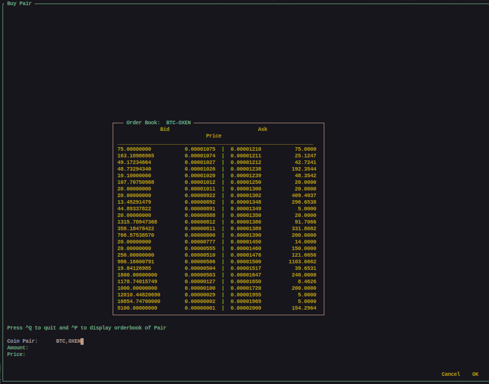
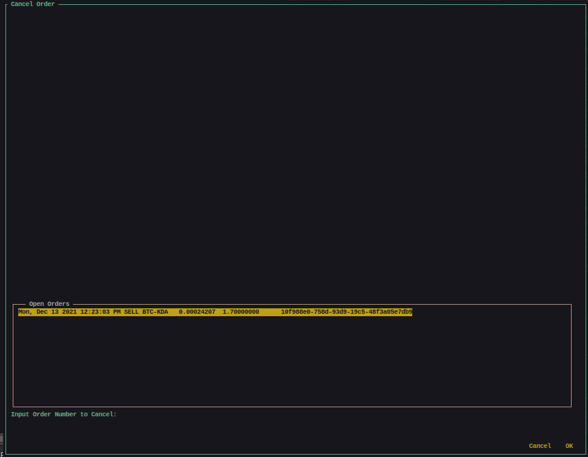

# totui (Trade Ogre TUI)
A textual user interface (TUI) for the popular TradeOgre exchange

## Install
Until I configure this for setuptools and **pip** install, the following will work for Python3.

```
git clone https://github.com/protomens/totui
cd totui
mkdir ~/.totui
cp config.ini ~/.totui
```


Install the following dependencies if you don't already have them installed:

```
pip3 install npyscreen
pip3 install requests
pip3 install shutil
pip3 install pkg_resources
```

## Configure

Edit **~/.totui/config.ini** to include your public and secret TradeOgre keys. These keys can be found by logging into your account and going to **settings**. Generate your keys if you haven't already. Paste the first into the first line under **[api]**,  **pub_key**. Paste after **=**. Paste the second key into the next line, **secret_key**, after the **=**.

All your changes within **totui** will be saved to this config file. It will startup how you left it.

Run:

`python3 totui.py`

**Note:** *Your terminal size must be at least 960x756 otherwise you will get an error when trying to run this.* 

## Screenshots

Main screen



Menu (Press Ctrl + X)



Buy & Sell Screen



Cancel Order



## Usage

Use *Ctrl+X* to access the menu. Use *Shift + Left Mouse Click* to select and copy text (*Ctrl + Shift + C*)

All settings change in the app are stored in the ~/.totui/config.ini

Deposit address cannot be generated via totui / tradeogre API, instead you copy them from within the TradeOgre site for handy reference. 

Withdraws are not allowed via API.

Each widget updates every 6 seconds. This include on the initial run. 

## Note
This is a first release. There are no sanity checks or try except conditions. If for whatever reason, TradeOgre does not respond, the app may crash. Bugs will be worked out via support issues. Consider Donating to ensure issues are handled appropriately. 

## Disclaimer

I am in no way responsible for your actions with this app. I am not liable for any erroneous buy/sell orders you may place using totui. Instead, be cautious and double check your orders before submitting them. This is good practice in general.

## License

GNU. 

# Tipjar

If you feel so inclined as to leave a tip this app will cotinue in development and issues raised will be handled in a timely manner. Programming costs time and money and donating helps the cause of open source and app development. 

`XMR: 82iYCRic1nQHb8RkU1T8ZYgebv7mzuxRJXiZ8fQ1crNoMtPqZRy4Rr1aJ9ND7RMd5uHTR9z8GbugGMSokmEq5JYsEuKtwHP`

`DERO: dERom2CggXZHszgZ4JeVe8Es56xdmj1bNULSZNCzpoQwHVVVAhSttcQPiLYxcAnNpB98MWh56HpJAFgqRngWBA5Z15EnWbdxeq`

`BTC: bc1q70qdes2xrxyc03fgwekmmt8j2rds0fmg3dehth`


