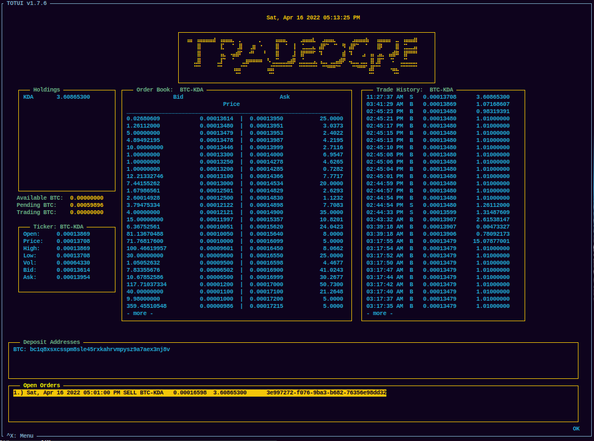

# totui (Trade Ogre TUI)
A textual user interface (TUI) for the popular TradeOgre exchange

Has the ability to:

* Place Buy Orders
* Place Sell Orders
* List Order Books, Tickers, and Action History
* Withdraw to address for most coins
* Locate Deposit address
* & more!

## Dependencies
* Latest Chrome Browser (stable)


## Install (pip)
```shell
pip3 install totui
```

Configure `~/.totui/config.ini` (see below), then run
 
```shell
totui
```


## Install (Source)
From git source

```shell
git clone https://github.com/protomens/totui
cd totui
```


Install the following dependencies if you don't already have them installed:

```shell
pip3 install npyscreen
pip3 install requests
pip3 install selenium
pip3 install undected_chromedriver
pip3 install bs4
pip install urllib3
```

Build & Install
```shell
cd totui && python3 -m build
python3 setup.py install
```


## Configure

Editing `~/.totui/config.ini` is no longer necessary. Upon starting the application it will prompt you for your user's Public and Private API key. This will be stored in the **config.ini** file going forward. 

Run:

`totui`


**Note:** *Your terminal size must be at least 178x62 otherwise you will get an error when trying to run this.* 

## Usage

Follow the menus and read the details. Read the on-screen instructions.

## Screenshot


## Disclaimer

I am in no way responsible for your actions with this app. I am not liable for any erroneous buy/sell orders you may place using totui or any lost coins. Instead, be cautious and double check your orders before submitting them. This is good practice in general.

It is advised that you double check the Deposit addresses TOTUI retrieves and verify all information before proceeding. Because TOTUI opens a Chrome Browser, simply open a new tab and double check for yourself. Reassurance is key when dealing with finances. Be safe. Be Secret. Be Secure. 

## License

GPL v3.0 

# Tipjar

If you feel so inclined as to leave a tip this app will cotinue in development and issues raised will be handled in a timely manner. Programming costs time and money and donating helps the cause of open source and app development. 

### Monero
```
82sirs3qe2XCvytxCnkVyS5q6v18MN8vHgpU1hZECmnKQzzcVNB5vXiDMz1Ktdp4pgKKjK2vsWdGABN8AAtHbFAaDg7A63t
```


### DERO 

```
dero1qyxctkgzee00jh3md4etc8kxkr8x4hh7cckezrhn7de39kj4xaf9xqqa6xeta
```


### Bitcoin

```
bc1qtvc9l3cr9u4qg6uwe6pvv7jufvsnn0xxpdyftl
```


